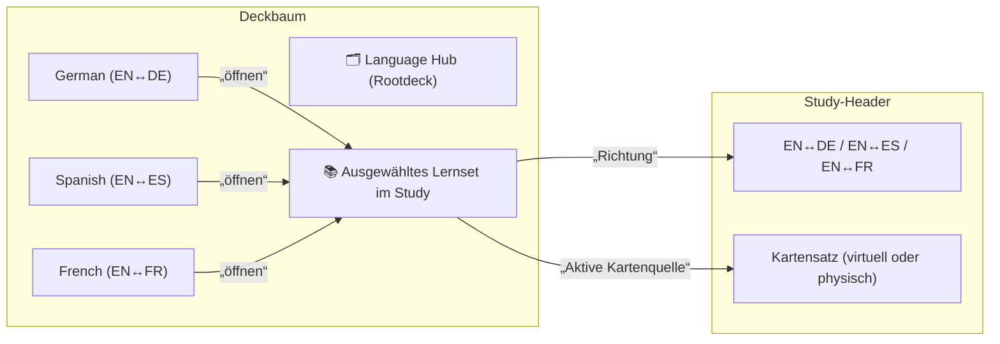

# Language Hub – Umsetzungsplan

## Zielbild

- Lernsicherheit hat Priorität: keine additive Pivot-Bildung über mehrere gleichsprachige Wörterbücher.
- Richtungsoptionen werden nur angeboten, wenn sie eindeutig aus den tatsächlich aktiven Datensatz-Metadaten ableitbar sind.
- Das Container-Masterdeck ist sprachneutraler Knoten, keine harte Richtungsvorgabe mehr.
- Das Sprach-Label in der Study-Ansicht ist immer auf den aktuell geladenen Datensatz/Subdeck bezogen.

## 1) Sprachmodell vereinheitlichen (Master neutral, Subdecks fest)

- Masterdeck erhält ein neutrales Sprachprofil (`languageNeutral`/`contentLocales` neutral), kein `EN->DE` oder ähnliches mehr.
- Jedes Wörterbuch-Subdeck speichert die tatsächliche Richtung als feste Richtung (keine Vererbung vom Master).
- Backfill-Logik: historische Imports, die bisher geerbte Richtungswerte nutzten, werden auf die aktuelle Subdeck-Richtung migriert.

## 2) Import-/Upsert-Pfad anpassen

- Beim Import neuer Wörterbuch-Decks: Richtungs-Metadaten pro Subdeck persistieren und validieren.
- Wenn Metadaten fehlen, wird nur lokal eindeutig ableitbar und sonst neutral gehandhabt.
- Bei späteren Imports derselben Sprache: kein Merge über mehrere Imports zur zusätzlichen Pivot-Bildung; bestehende Richtungsbasis bleibt konservativ.
- Masterdeck-Name wird auf **Language Hub** gesetzt.

## 3) Pivot-/Matching-Engine auf generisches Wörterbuchmodell umbauen

- Xefjord-spezifische Sonderpfade auf generische Wörterbuchlogik abbilden.
- Richtungen (z. B. `EN->DE`) nur dann aktivieren, wenn die Richtung im aktiven Subdeck verlässlich vorhanden ist.
- Beim Deck-Wechsel werden nur die Richtungen des aktuellen Subdecks geladen; kein Leakage aus zuletzt geöffneten Datensätzen.
- Keine additive Kombination gleicher Richtungen aus mehreren Imports.

## 4) Study-Header-/Label-Korrektur

- Sprache-Darstellung oben rechts zeigt immer die reale Richtung des aktuellen Datensatzes.
- Wenn keine Richtung ableitbar ist, wird ein neutraler, nicht irreführender Hinweis angezeigt.
- Sofortige Korrektur bei Wechsel zwischen französischen, deutschen und spanischen Xefjord-Unterdecks oder anderen Sprachdecks.

## 5) Tests und Abnahme

- Unit-Tests:
  - Master neutral, Subdecks fix.
  - Sprachlabel folgt aktivem Datensatz nach Deck-Wechsel.
  - Legacy-Werte (z. B. falsche `EN->DE`-Anzeige) werden korrigiert.
  - Kein Pivot-Output aus multiplen gleichsprachigen Imports.
- Integrationstests:
  - Import/Wechsel/Study-Ladezeit im normalen Pfad.
  - Keine Regression in bestehenden Lernroutinen.
- Fokus auf reale User-Pfade statt nur Code-Härtung.

## 6) Rollout-Reihenfolge

1. Datenmodell + Import-Backfill
2. Pivot-Engine (allgemein + Master-neutral)
3. Study-Label-Fix (UI + Verhalten)
4. Tests + kurzes QA auf Performance (Deck-Wechsel, Ladezeit, Richtungsanzeige)

## Offene Beschlussfragen

- Soll der neutrale Fallback explizit als `Language Hub`-Tag im UI angezeigt werden oder komplett versteckt bleiben?
- Gibt es eine Minimal-Schwelle für sichtbare Richtungen bei unsicheren Metadaten (z. B. nur wenn beide Seiten vorhanden)?
