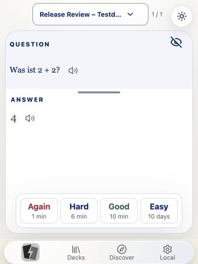
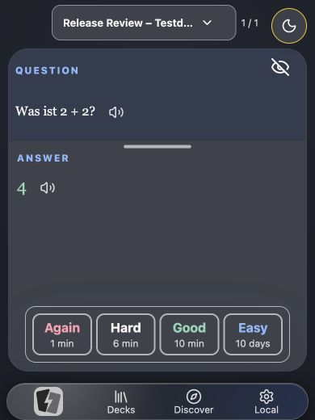
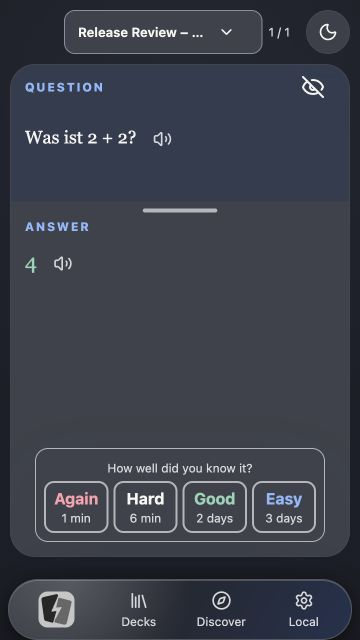
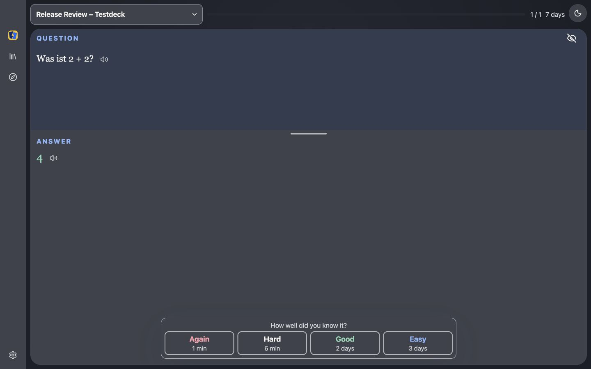
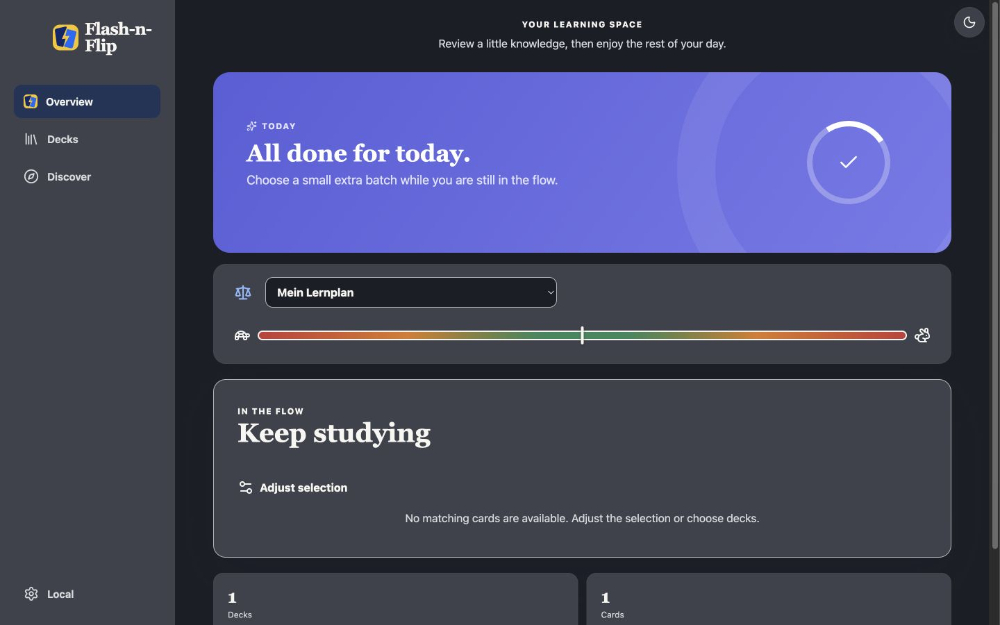

# Flash-n-Flip: Review für einen App-Store-Releasekandidaten

Stand: 30. September 2026. Geprüfte Ausgangsbasis: `9f8dddf1593135f742abdf0100362b13a1b60d2c`, Version `0.5.179`.

**Ergebnis: technische Verbesserungen umgesetzt und geprüft; öffentliche Release-Freigabe bleibt blockiert.** Grüne Pakettests und ein erfolgreicher Simulatorbuild reichen hier nicht zur Freigabe. Es fehlen reale Apple-Geräteabnahmen, eine widerspruchsfreie Synchronisationsentscheidung und die dokumentierten Betreiber-/Legal-Entscheidungen.

Der Auftrag umfasst Untersuchung, Korrekturen, aussagekräftige Regressionstests und einen Commit mit Push. Es wurde kein VPS-Deployment und kein App-Store-Upload durchgeführt. Der alte FlashCards-Checkout wurde nicht verändert. Die bereits vorhandene Pianoforte-Website ist kein Gegenstand der funktionalen Änderungen.

## 1. Umfang und Beweiskraft

Untersucht wurden Import/Dekompression, SVG-Inhalte, lokale Persistenz und Reviews, Backup-Export, Mikrofon-Lebenszyklus, Apple-Plist/Privacy-Ressourcen, Proxy-Vertrauen, Abhängigkeiten, Lernintervalle, Dashboard-Zähler, Release-Dokumentation und die Qualität der Tests. Zusätzlich wurde der lokal gebündelte React-Einstieg in Chrome über die tatsächlichen Bedienwege geprüft.

Die Prüfung ist keine vollständige Penetrationstest-Zertifizierung. Insbesondere wurden kein signiertes Gerätearchiv, keine App-Store-Connect-Konfiguration und keine reale CloudKit-/Peer-Replikation auf zwei Geräten abgenommen. Die Online-Audit-Anfrage mit Abhängigkeitsnamen und Versionen erfolgte nach ausdrücklicher Freigabe durch den Nutzer.

## 2. Behobene Befunde

| Befund                                                                        | Auswirkung vor der Änderung                                                                                                                                                                                        | Korrektur und Nachweis                                                                                                                                                                                                                                                                                                                                                                                           |
| ----------------------------------------------------------------------------- | ------------------------------------------------------------------------------------------------------------------------------------------------------------------------------------------------------------------ | ---------------------------------------------------------------------------------------------------------------------------------------------------------------------------------------------------------------------------------------------------------------------------------------------------------------------------------------------------------------------------------------------------------------- |
| SVG-Filter umgehbar durch CSS-Escapes                                         | Verschleierte `url()`-/externe Referenzen konnten den Textfilter passieren. Das schwächt die Zusage, dass importierte SVGs keine externen Inhalte referenzieren.                                                   | Escape-/Kommentarsyntax in CSS-relevanten SVG-Attributen wird zurückgewiesen. Regressionstest mit verschleierter Referenz schlug vor der Änderung fehl und besteht danach. Keine Behauptung eines nachgewiesenen Script-Exploits.                                                                                                                                                                                |
| ZIP-/Zstandard-Limits nach zu früher Dekompression                            | Ein kleines komprimiertes Archiv konnte bereits vor der Größenkontrolle große Ausgaben bzw. Decoder-Fenster auslösen. Eine eager CRC-Prüfung in JSZip entpackt ebenfalls vor den bisherigen Grenzen.               | ZIP-Verzeichnis vor JSZip prüfen; Größen und Eintragszahl begrenzen; ZIP-Einträge gestreamt mit tatsächlichem Bytebudget, Größenvergleich und CRC lesen. Zstandard-Frames einschließlich verketteter/skippable Frames vorallokierend prüfen und die tatsächliche Ausgabe begrenzen. Tests decken manipulierte Größen, CRC, Abbruch, übergroße Fenster und abgeschnittene Daten ab.                               |
| Vollständiger JSON-Backup-Export nutzt im Apple-WebView einen Browserdownload | Die Oberfläche konnte Erfolg melden, obwohl dieser Weg den nativen Exportadapter umging.                                                                                                                           | Settings verwendet den gemeinsamen Exportweg. Swift erlaubt zusätzlich `.json` mit `application/json`; andere MIME-/Suffix-Kombinationen und Pfadnamen bleiben zurückgewiesen. Abbruch meldet keinen Exporterfolg. Swift kompiliert im Release-Simulatorbuild.                                                                                                                                                   |
| Zusätzliche vollständige Speicher-Kopie beim nativen Export                   | Der JS-Adapter las den gesamten Blob vor der Aufteilung in Bridge-Chunks.                                                                                                                                          | Blob wird in 256-KiB-Stücken gelesen. Ein 600.000-Byte-Test prüft exakte Chunkgrößen und Inhalt; ein Spy verbietet den vollständigen `blob.arrayBuffer()`-Aufruf.                                                                                                                                                                                                                                                |
| Fehlende Mikrofon-Nutzungsbeschreibung                                        | Der vorhandene Aufnahmeweg hatte keine passende `NSMicrophoneUsageDescription`; das ist eine relevante iOS-Berechtigungs-/Release-Lücke.                                                                           | Beschreibung ergänzt; Kamerabeschreibung an das tatsächlich vorhandene Fotoaufnahme-Verhalten angepasst. Plist-Prüfung, Apple-Strukturtest und Xcode-Build bestanden. Die echte Berechtigungsdialog-Abnahme bleibt offen.                                                                                                                                                                                        |
| Kein eigenes Required-Reason-Manifest für System-Uptime                       | Native Codepfade benutzen `systemUptime` für interne Laufzeitmessungen; die App hatte hierfür kein eigenes eingebundenes Manifest.                                                                                 | `PrivacyInfo.xcprivacy` mit `NSPrivacyAccessedAPICategorySystemBootTime` / `35F9.1` als Xcode-Ressource eingebunden. Das ist keine vollständige Datenschutzlabel-Erklärung und keine pauschale SDK-Freigabe.                                                                                                                                                                                                     |
| Mikrofon bleibt bei verspäteter Freigabe/Fehler aktiv                         | Schließen des Editors während der Berechtigungsanfrage oder ein Recorder-Konstruktionsfehler konnte Tracks zurücklassen.                                                                                           | Abbrechbarer Capture-Lebenszyklus, Freigabe verspäteter Streams, Cleanup bei Konstruktorfehler und Abbruch aktiver Aufnahme. Drei Verhaltenstests prüfen Track-Stop und unterdrückte Veröffentlichung partieller Audiodaten.                                                                                                                                                                                     |
| Feste Bewertungsintervalle widersprechen FSRS                                 | Die Oberfläche versprach beispielsweise „Good: 6 Tage“, obwohl die erste tatsächliche Lernstufe zehn Minuten sein kann.                                                                                            | Anzeige verwendet `current.preview` aus dem vorhandenen Scheduler, mit lokalisierten Einheiten. Scheduler selbst unverändert. Drei Tests vergleichen Preview und angewendete Bewertung; die echte Oberfläche zeigte für die Testkarte 1/6/10 Minuten und 10 Tage.                                                                                                                                                |
| Dashboard bleibt bei alten Kartenzählern                                      | Nach dem Speichern konnte die Übersicht dauerhaft null Karten zeigen, bis eine andere Ansicht den Cache aktualisierte. Die Karte selbst war vorhanden.                                                             | Schnelle Metadatenanzeige bleibt erhalten; autoritative lokale Aggregate werden anschließend geladen, mit Schutz gegen veraltete Async-Ergebnisse. Sichtprüfung nach Neuladen zeigt ein Deck und eine Karte.                                                                                                                                                                                                     |
| Sicherheitsupdates und Proxy-Konfiguration                                    | Bekannte Abhängigkeitslücken; eine reine numerische Hop-Anzahl validierte keine tatsächlichen Proxy-Adressen. Der aktualisierte Fastify unterstützt diese unsichere Form nicht mehr.                               | Next, Fastify, Sharp und mehrere kompatible transitive Versionen aktualisiert. Beide API-Einstiege verwenden einen gemeinsamen Trust-Adapter: höchstens zwei private/Loopback-Proxyhops. Verhaltenstests prüfen normale Proxy-Kette, öffentliche Absender, eingeschleuste/exzessive Hops und IPv4-mapped IPv6. Voraussetzung bleibt die dokumentierte private Compose-Netzgrenze ohne veröffentlichten API-Port. |
| Build-/Prüfinkonsistenzen                                                     | Veraltete Next-Routentypen konnten den Typecheck brechen; das Apple-local-Buildziel erzeugte sein Ausgabeverzeichnis nicht explizit.                                                                               | Web/Admin generieren Routentypen vor Lint/Typecheck. Build legt sein Ausgabeverzeichnis nach dem Cleanup an. Vollständige Prüfungen und Produktionsbuilds bestanden.                                                                                                                                                                                                                                             |
| Veraltete Tests/Dokumentation                                                 | Ein Test verlangte einen nicht mehr vorhandenen Löschpfad; ein neuer Source-String-Test reagierte auf Formatierung. Die mobile Anleitung behauptete fälschlich, Entitlements und CloudKit-Registrierung seien aus. | Assertions aktualisiert und gegenüber Whitespace robust gemacht. Mobile Anleitung auf gebündelte lokale Abnahme ausgerichtet; reale iCloud-Grenze und Apple-Testmatrix dokumentiert. Architekturentscheidung nicht stillschweigend umgeschrieben.                                                                                                                                                                |

Wesentliche Dateien: `apps/web/lib/bounded-import-compression.ts`, `packages/domain/src/svg-sanitizer.ts`, `apps/web/lib/local-file-export.ts`, `apps/web/lib/editor-audio-capture.ts`, `apps/web/components/study-rating-interval.ts`, `apps/web/components/dashboard.tsx`, `apps/api/src/proxy-trust.ts` und die Apple-Ressourcen/Exportbridge.

## 3. Abhängigkeitsprüfung

| npm-Audit-Ergebnis | Kritisch | Hoch | Moderat | Gesamt |
| ------------------ | -------: | ---: | ------: | -----: |
| Vorher             |        2 |   43 |      14 |     59 |
| Nach Updates       |        0 |    5 |       3 |      8 |

Direkte Updates: Web/Admin `next 16.2.11 → 16.3.7`, API `fastify 5.10.0 → 5.12.5`, Root-Buildwerkzeug `sharp 0.34.5 → 0.35.5`. Die kontrollierten Overrides bleiben jeweils innerhalb der bisherigen Major-Linie: PostCSS, Nanoid 3, Fast-URI 3/4, js-yaml 4, xmldom 0.8/0.9 und image-size 2.

Die acht verbleibenden Advisories hängen laut Audit am Pfad `apps/api → drizzle-orm → expo-sqlite → expo` mit weiteren Unterabhängigkeiten: `uuid`, `brace-expansion`, `decode-uri-component` und `image-size 1`. Das sind mehrere Advisories für vier Paketfamilien. Ihre aktuellen Fixes erfordern Major-/API-Wechsel außerhalb der hier geprüften alten Expo-Integration. Deshalb wurden sie nicht durch ungeprüfte globale Major-Overrides kaschiert. Sie sind ein offener Sicherheitsbefund für die Wiederverwendung dieser alten Laufzeit. Die Audit-Pfade weisen keine Zuordnung zum aktiven Apple-App-Paket aus; damit ist dennoch keine vollständige Erreichbarkeitsanalyse des erzeugten JS-Bundles behauptet.

## 4. Aussagekraft und Erweiterung der Tests

Das Monorepo hat **1.901 bestandene Pakettests**. Die Zählung bedeutet keine entsprechende Zahl unabhängiger Benutzerabläufe.

| Paket                   | Bestandene Tests |
| ----------------------- | ---------------: |
| Web                     |              964 |
| API                     |              329 |
| Domain                  |              263 |
| Direct-connect-Webstack |              169 |
| Sync                    |               99 |
| API-Client              |               29 |
| Apple                   |               17 |
| Scheduler               |               11 |
| Peer-Transfer           |                6 |
| i18n                    |                5 |
| Package-Format          |                5 |
| Admin                   |                4 |

**Stärken:** vorhandene Verhaltensprüfungen für Scheduler, lokale Transaktionen, Importformate, Synchronisationskonflikte und Replikationszustände; neue gezielte Fehlerfälle statt ausschließlich Happy Paths. Der ergänzte Review-Retry-Test öffnet ein neues Repository auf demselben Speicher und prüft: bestehender Review wird nicht doppelt gespeichert, Kartenstand und dauerhafte Outbox bleiben exakt gleich. Die vorhandene Duplicate-Fehlersemantik bleibt bewusst erhalten.

**Grenzen:** In 51 von 172 Web-Testdateien finden sich Quelltext-Leseoperationen zusammen mit String-/Regex-Assertions (grobe Bestandsaufnahme, keine vollständige Testklassifikation). Diese Tests können Adaptergrenzen, CSS-Regeln und Ressourcenreferenzen sichern; sie beweisen keine gerenderte Lesbarkeit, funktionierende Gesten oder native Berechtigung. Die 17 Apple-Tests sind ebenfalls überwiegend Strukturprüfungen. Fake-IndexedDB plus neues Repository ist ein Reopen-Test, kein echter iOS-Prozessneustart. Mock-CloudKit-Tests beweisen keine Remote-Durabilität.

Neu hinzugekommen sind acht ZIP/Zstandard-Sicherheitsfälle, drei Audio-Lebenszyklusfälle, drei Scheduler-Anzeigefälle, ein SVG-Bypassfall, ein großer gestückelter JSON-Exportfall, ein dauerhafter Review-Retry-Fall, vier Proxy-Spoofing-Fälle und eine Apple-Ressourcen-/MIME-Grenzprüfung. Das Dashboard wurde zusätzlich im realen sichtbaren Weg geprüft.

## 5. Sichtprüfung und Layout

Testumgebung: isolierter lokaler Origin `http://127.0.0.1:8099`, eigenes Testdeck „Release Review – Testdeck“, Textkarte „Was ist 2 + 2?“ / „4“. Keine produktiven Lerndaten für die UI-Testabläufe verwendet.

Ausgeführt: Deck erstellen, Karte speichern, Lernmodus öffnen, Antwort einblenden, echte Bewertungsintervalle lesen, `Good` bewerten, Abschluss sehen, Übersicht neu laden, Karte erneut öffnen und JSON-Backup herunterladen. Das heruntergeladene JSON hat 12.575 Bytes und enthält Authority-Envelope mit fünf Entitäten, sieben Journal-Mutationen und sieben Outbox-IDs; Medienbestand der Testbibliothek ist leer. Damit wurde kein Medien-Roundtrip bewiesen.

| Gemessener Viewport            | Kartenmaß  | Innenabstand | Dokumenthöhe | Ergebnis             |
| ------------------------------ | ---------- | ------------ | ------------ | -------------------- |
| 390 × 844, Frage hell          | 370 × 697  | 14 px        | 844 px       | Kein Seitenscrolling |
| 390 × 520, Antwort hell/dunkel | 370 × 400  | 10 px        | 520 px       | Aktionen erreichbar  |
| 360 × 640, Antwort dunkel      | 340 × 493  | 14 px        | 640 px       | Kein Seitenscrolling |
| 1440 × 900, Antwort dunkel     | 1356 × 820 | 14 px        | 900 px       | Kein Seitenscrolling |

Die ausgeführten Kartenlayout-Checks erfüllen mindestens 75 % Breite/Höhe und 10–20 px Innenabstand. Der gemessene 390×520-Überlappungscheck für Karte, Theme-Schalter und Mobilnavigation besteht mit 10 px Schutzabstand. Die Ratingbuttons dort messen rund 74 × 50 px. Die Prüfung ist auf die erfassten Elemente und die kurze Textkarte begrenzt; Karten-, Formel-, Medien- und lange Inhaltslayouts sind weiterhin gesondert abzunehmen.

Für die sichtbaren Rating-Farben wurden aus den gerenderten Farben folgende Kontraste berechnet: hell Again 7,17:1, Good 6,78:1, Hard/Easy 13,79:1; dunkel Again 5,17:1, Hard 9,33:1, Good 5,94:1, Easy 4,97:1. Das genügt für diese Texte der AA-Schwelle 4,5:1. Der statische Readability-Scan hatte keine harten Fehler, aber 318 manuell zu prüfende Fundstellen im gesamten Repository; daraus folgt keine allgemeine Kontrastfreigabe.

Ein Versuch mit Zoom-Tastenkürzeln veränderte den gemessenen Viewport nicht. **200-%-Zoom ist daher nicht verifiziert.** VoiceOver, Dynamic Type, reale Safe Areas und WKWebView-Gesten sind ebenfalls offen. Kleinere vorhandene Copy-Inkonsistenzen bleiben sichtbar, etwa „1 cards“/„1 reviews“ und der deutsche Standardplanname bei englischer Oberfläche; diese sind gegenüber den Release-Blockern nachrangig.

Die UI-Wiederherstellung auf dem getrennten, leeren Origin `http://localhost:8099` konnte nicht ausgeführt werden: Der Browser-Dateiupload wurde wegen fehlender Dateirechte der Erweiterung abgewiesen. Zur Freigabe dieses Automationswegs in Google Chrome: `chrome://extensions` → ChatGPT-Erweiterung → Details → „Allow access to file URLs“. [Dokumentation zum Dateiupload](https://developers.openai.com/codex/app/chrome-extension#upload-files). Diese Berechtigung wurde nicht eigenständig erweitert.

### Sichtbelege

Die reproduzierbaren Koordinaten für den kleinen Überlappungscheck stehen in `study-overlap-measurements.json`.

## 6. Ausgeführte technische Gates

| Prüfung                                                                    | Status                                                    | Praktische Grenze                                                                  |
| -------------------------------------------------------------------------- | --------------------------------------------------------- | ---------------------------------------------------------------------------------- |
| `pnpm test`                                                                | erfüllt: 1.901 Tests                                      | Teilweise Quelltext-/Mock-Prüfungen                                                |
| `pnpm lint`                                                                | erfüllt                                                   | Hier überwiegend TypeScript-Prüfung                                                |
| `pnpm typecheck`                                                           | erfüllt: 21 Tasks                                         | Kein Runtime-Nachweis                                                              |
| `pnpm build`                                                               | erfüllt: 13 Tasks                                         | Web/Admin sowie Apple-local-Bundle und Capacitor-Sync                              |
| Xcode Release / iOS Simulator                                              | erfüllt: `BUILD SUCCEEDED`                                | `CODE_SIGNING_ALLOWED=NO`; kein signiertes Gerätearchiv                            |
| Simulatorinstallation und Start                                            | erfüllt für den Zwischenstand mit den nativen Korrekturen | Keine interaktive native Sichtabnahme; Simulator über UI-Werkzeug nicht erreichbar |
| Plist/Privacy-Ressourcen                                                   | erfüllt strukturell und im Build                          | Echter Berechtigungsdialog/Privacy-Report offen                                    |
| Curated-Bundle-Prüfung                                                     | erfüllt                                                   | Signatur-/Bestandsprüfung, keine vollständige zweite Geräteinstallation            |
| Direct-Connectivity-Policy                                                 | erfüllt                                                   | Statische STUN-only-/No-TURN-Grenze; kein Live-Sync-Beweis                         |
| Content/Learning/Sync/Publishing-Guardrails                                | erfüllt                                                   | Strukturchecks, kein Ersatz für Benutzer-/Gerätetests                              |
| Brand/Lucide/Soundfont/Editor-Blacklist-Checks und zugehörige Script-Tests | erfüllt im `pnpm check` vor dem i18n-Abbruch              | Keine App-Store-Freigabe                                                           |
| Third-party-notices `--check`                                              | erfüllt                                                   | Kein Rechtsgutachten                                                               |
| `pnpm check` gesamt                                                        | offen / fehlgeschlagen                                    | Stoppt an 86 harten Textfunden ausschließlich in vorhandenen Pianoforte-Seiten     |
| `pnpm format:check` gesamt                                                 | offen / fehlgeschlagen                                    | 39 bereits vorhandene Dateien; keine geänderte Quelldatei darunter                 |
| Format der geänderten prüfbaren Dateien und `git diff --check`             | erfüllt                                                   | Generiertes JS/Swift/PBX nach jeweiligem Build geprüft                             |
| `pnpm release:check`                                                       | Release-Blocker                                           | Acht explizite Legal-Gates; Exit-Code 8                                            |

Die nicht erreichten Folgeschritte des gescheiterten Gesamtchecks wurden, soweit hier aufgeführt, einzeln ausgeführt. Die bestehenden Pianoforte-/Formatprobleme wurden nicht durch ein Abschwächen der Prüfskripte verborgen. Eine projektweite Formatierung fremder funktionaler Bereiche wurde vermieden.

## 7. Verbleibende Release-Blocker und Risiken

**R1 – Architektur-/Produktkonflikt, Release-Blocker.** Die aktuellen Repository-Anweisungen verlangen direkte E2E-WebRTC-Replikation und verbieten CloudKit als zweite Live-Autorität. ADR 0049 beschreibt hingegen einen Apple-only-Local-Runtime ohne Peer-Pfad; ADR 0052 zielt auf iCloud-Replikation. Beide Xcode-Konfigurationen referenzieren inzwischen `App.CloudKit.entitlements`, die Scene registriert Cloud-Adapter. Der mutierende Cloud-Library-Accountadapter bleibt durch das fehlende `FNFCloudLibraryEnabled`-Flag bei `NOT_CONFIGURED`; eine getrennte Inventar-Schicht existiert ebenfalls. Dieses Review hat keinen Flag aktiviert. Vor Store-Versprechen zu Sync muss verbindlich feststehen, welche Architektur und Datenflüsse ausgeliefert werden.

**R2 – „Manual only“-Dokumentation widerspricht Runtime, Release-Blocker für Sync-Aktivierung.** ADR 0052 schließt Ereignis-/Retry-/Reload-Trigger ausdrücklich aus. Die vorhandene Runtime und ihre Tests enthalten bereits Event-Coalescing und Deck-Change-Auslöser. Dokumentation und tatsächliche Aktivierungsgrenze müssen gemeinsam abgeglichen werden. Ein grüner Account-Check oder eine Capability beweist keine vollständige Synchronisation.

**R3 – Datenintegritätsabnahme auf Geräten, extern blockiert und Release-Blocker.** Offen sind SQLite-Durabilität nach Force-Quit, Offline-Coldstart, unterbrochene Installation/Medientransfers, vollständiger Backup-Restore auf einem frischen zweiten Apple-Gerät sowie konfliktbehaftete Reviews/Edits, Wiederzustellung, Löschmarker und Account-/Gerätewechsel im gewählten Sync-System. Diese Schritte brauchen reale Geräte und, für iCloud, passende Bereitstellung/Signierung. Sie sind nicht durch Fake-IndexedDB ersetzt.

**R4 – Betreiber-/Legal-Gates, Release-Blocker.** `docs/legal/open-items.md` enthält acht ausdrücklich nicht zu erratende Punkte: Produktionslog-Felder/Retention, Legacy-Löschung und Backup-Ablauf, netcup-AV-Vertrag, Geschäftsstatus, Steuerkennzeichen, EU-DSA-Trader-Status, Minderjährigen-/Alterspolitik und qualifizierte Prüfung finaler Rechtstexte. Sie wurden weder als erledigt markiert noch mit Annahmen ersetzt. Ob einzelne VPS-bezogene Angaben beim endgültigen Apple-only-Datenfluss anders zugeschnitten werden müssen, ist anhand des tatsächlich weiter betriebenen Angebots zu entscheiden.

**R5 – Store-/Accessibility-Abnahme, offen bzw. extern blockiert.** Signiertes Archive/TestFlight, vollständiger Privacy-Report einschließlich gebündelter SDKs, Privacy Labels, reale Mikrofon-/Kameradialoge, Support-/Store-Metadaten, Altersrating und Screenshots benötigen Abnahme. Zusätzlich fehlen VoiceOver, Dynamic Type/200-%-Zoom, iPad/Rotation und Apple-silicon-Mac. Keine allgemeine UI-Parität behauptet.

**R6 – Große Sicherungen, offenes Datenrettungsrisiko.** Der native Dateiexport begrenzt auf 256 MiB, während JSON-Restore bis 700 MiB akzeptiert; JSON-Erstellung hält außerdem weiterhin den vollständigen Backup-Inhalt im Speicher. Chunking der Bridge beseitigt nur eine zusätzliche Kopie. Bei großen lokalen Bibliotheken kann der Vollbackup-Weg weiterhin scheitern. Vor einer uneingeschränkten Recovery-Zusage müssen konsistente Größenverträge und ein realer großer Medien-Roundtrip umgesetzt/geprüft werden. Limits wurden nicht einfach entfernt.

**R7 – Acht verbleibende Legacy-Abhängigkeitsadvisories, offen.** Details in Abschnitt 3. Vor Reaktivierung des betroffenen Expo/API-Zweigs aktualisieren und dessen echte Nutzung prüfen. Nicht als „Audit ohne Befunde“ bewerben.

**R8 – Gesamtcheck/Format und kleinere Sprachprobleme, offen.** Die bestehende Pianoforte-i18n-Ausnahme bzw. deren korrekte Integration in den gemeinsamen Scanner muss in ihrem eigenen Produktkontext entschieden werden; 39 Formatbefunde bestehen fort. Singular/Plural-Copy und englisch/deutscher Planname benötigen eine kleine konsistente i18n-Nacharbeit. Für Flash-n-Flip selbst wurde kein neuer i18n-Scannerbefund eingeführt.

## 8. Empfohlene nächste Freigabeschritte

1. Ein verbindliches ADR mit der ausgelieferten Sync-/Backup-Grenze verabschieden und Code, Flags, Datenschutzerklärung und Store-Texte darauf ausrichten.
2. Die acht Legal-Punkte mit den tatsächlichen Betreiberfakten erledigen. Release-Gate nicht umgehen.
3. Größenvertrag des Vollbackups klären und große Bibliothek mit Originalmedien auf frischem zweitem Apple-Gerät wiederherstellen.
4. Die aktualisierte `docs/quality/test-matrix.md` auf echten Geräten ausführen, insbesondere Force-Quit, Offline und alle Sync-Konflikt-/Unterbrechungsfälle.
5. VoiceOver, Dynamic Type, 200-%-Zoom und komplexe Kartenlayouts mit gespeicherten Belegen abnehmen.
6. Signed Archive und TestFlight mit Privacy-Report und finalen Metadaten prüfen. Erst danach einen öffentlichen Releasekandidaten benennen.

## 9. Primärquellen zur Einordnung

- [Apple App Review Guidelines](https://developer.apple.com/app-store/review/guidelines/de/): vollständige, tatsächlich überprüfbare Anwendung und korrekte Datenschutzaussagen.
- [Apple: NSMicrophoneUsageDescription](https://developer.apple.com/documentation/BundleResources/Information-Property-List/NSMicrophoneUsageDescription): Zweckbeschreibung für Mikrofonzugriff.
- [Apple: Required-Reason API Types](https://developer.apple.com/documentation/bundleresources/app-privacy-configuration/nsprivacyaccessedapitypes/nsprivacyaccessedapitype): deklarationspflichtige API-Kategorien und zulässige Gründe.
- [Apple: Third-party SDK requirements](https://developer.apple.com/support/third-party-SDK-requirements/): zusätzliche Manifest-/Signaturanforderungen an betroffene SDKs.
- [Zstandard-Formatspezifikation](https://github.com/facebook/zstd/blob/dev/doc/zstd_compression_format.md): Frame-, Window-, Block- und verkettete Frame-Struktur für die vorgelagerte Limitprüfung.
- [DSGVO, offizieller EUR-Lex-Text](https://eur-lex.europa.eu/legal-content/EN/TXT/?uri=CELEX%3A32016R0679): Transparenzanforderungen müssen den tatsächlichen Datenfluss abbilden; dies ersetzt keine qualifizierte Rechtsprüfung.
