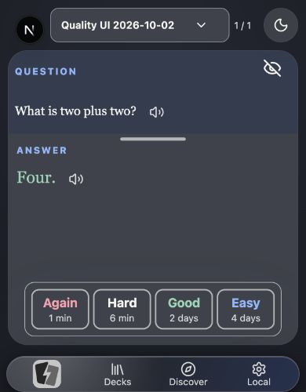
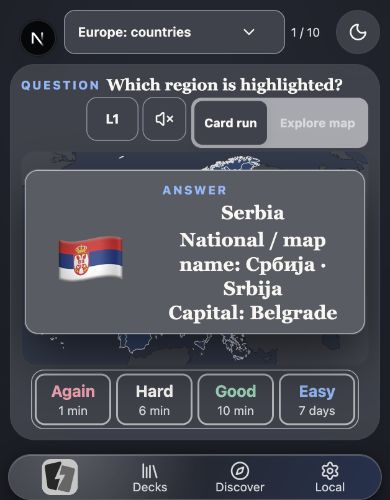

# Flash-n-Flip: Editor-, Datenintegritäts- und UI-Nachprüfung

Stand: 2. Oktober 2026. Projektversion `0.5.179`.
Ausgangscommit dieser Nacharbeit: `6c439672d4cb4037f04747f3d1b173e43fe4dd2e`.

Die Nachprüfung behebt weitere konkrete Fehler beim Speichern, bei
Medienaktualisierungen und im gerenderten Lernlayout. Sie ergänzt den
[vorherigen ausführlichen Bericht](quality-improvements.md), der unter anderem
Abhängigkeiten, iCloud-Aktivierung, Settings, Scheduler-Abfragen und Backup-Restore
behandelt. Beide Berichte gehören zum selben Qualitätsauftrag.

**Eine App-Store-Freigabe ist weiterhin nicht nachgewiesen.** Die hier dokumentierte
Browserprüfung verbessert den tatsächlichen Oberflächennachweis. Für den
gebündelten iOS-WebView, physische Geräte, iCloud zwischen zwei Geräten und ein
signiertes Store-Archiv bleiben separate Abnahmen erforderlich. Aus Build- oder
Unit-Erfolgen wird keine Geräteabnahme abgeleitet.

## 1. Gefundene Fehler und Korrekturen

| Befund                                                                                             | Auswirkung                                                                                                                                                                 | Korrektur und Nachweis                                                                                                                                                                                                                                                                                                                                                                           |
| -------------------------------------------------------------------------------------------------- | -------------------------------------------------------------------------------------------------------------------------------------------------------------------------- | ------------------------------------------------------------------------------------------------------------------------------------------------------------------------------------------------------------------------------------------------------------------------------------------------------------------------------------------------------------------------------------------------ |
| Die vorhandene Editor-Mutations-ID wurde im lokalen Repository ignoriert.                          | Nach dauerhaftem COMMIT und verlorener Bridge-Antwort konnte der identische Versuch als veralteter Stand abgewiesen werden; neue Karten konnten neue Identitäten erhalten. | Eine lokale Commit-Quittung mit Request-Hash und Mutations-IDs wird atomar mit Entitäten, Journal, Outbox und Wasserständen gespeichert. Identische Wiederholung bestätigt den bestehenden Stand ohne weitere Mutation. IndexedDB- und echte SQLite-Tests prüfen unveränderte Journale und Outboxes.                                                                                             |
| Neu angelegte Lernsets erhielten bei jedem fehlgeschlagenen Versuch neue IDs.                      | Ein bereits gespeichertes Lernset konnte beim erneuten Versuch dupliziert werden.                                                                                          | Der Editor behält Deck- und Mutations-ID über den fehlgeschlagenen Versuch hinweg. Der echte IndexedDB-Pfad bestätigt identische Wiederholungen; ein montierter Editor-Test prüft stabile Aufträge und genau eine Navigation.                                                                                                                                                                    |
| Neu angelegte Karten erhielten beim erneuten Speichern neue Karten-/Notiz-IDs.                     | Wiederholung konnte vom ursprünglichen Auftrag abweichen.                                                                                                                  | Entwurfsidentitäten bleiben bis zum erfolgreichen Speichern oder bewussten Zurücksetzen erhalten. Der Verhaltenstest klickt den sichtbaren Speichern-Button und vergleicht die vollständigen wiederholten Aufträge.                                                                                                                                                                              |
| Wiederholte Formularereignisse konnten parallel speichern.                                         | Parallele Schreibaufträge und widersprüchliche Rückmeldungen waren möglich.                                                                                                | Ein synchroner In-Flight-Lock sperrt weitere Aufträge bis zum Abschluss. Der Test löst zwei Submit-Ereignisse aus, hält den ersten Commit offen und prüft genau einen Schreibauftrag sowie die anschließende Freigabe.                                                                                                                                                                           |
| Eine verspätete Ladeantwort von Lernset A konnte den bereits geöffneten Editor B überschreiben.    | Bearbeitung und Speicherung konnten sich auf das falsche Lernset beziehen.                                                                                                 | Aufräumen des Route-Effekts verwirft alte Antworten. Der montierte Test liefert A erst nach B und prüft sichtbaren Titel sowie Speichern nach B.                                                                                                                                                                                                                                                 |
| Dasselbe Problem bestand für eine verspätete Speicherantwort.                                      | Ein erfolgreicher alter Save konnte den aktuellen Editor ersetzen.                                                                                                         | Eine Route-Generation schützt Erfolg, Fehleranzeige und Navigation. Der neue Regressionstest war vor der Korrektur rot: Statt „Current deck“ wurde „Late save“ angezeigt. Nach der Korrektur bleibt B sichtbar und der nächste Schreibauftrag betrifft B. Der bereits gestartete Commit nach A wird nicht rückwirkend verworfen.                                                                 |
| Verweigerter `localStorage` brach das Laden bzw. die Inhalts-Sprachauswahl ab.                     | Ein optionaler Cache konnte den autoritativen lokalen Editor unbenutzbar machen.                                                                                           | Cache-Lesen und -Schreiben werden abgefangen. Der Verhaltenstest verweigert beides und prüft weiterhin Laden, Sprachauswahl und Commit.                                                                                                                                                                                                                                                          |
| Paketinstallation löschte Medien nach einer verlorenen COMMIT-Antwort.                             | SQLite konnte auf gerade gelöschte, bereits veröffentlichte Dateien zeigen.                                                                                                | Nach Beginn der Veröffentlichung bleibt verifiziertes Staging erhalten. Tests verwenden eine echte dateibasierte SQLite-Engine, führen COMMIT aus, verlieren dessen Antwort, öffnen erneut und prüfen Originaldaten sowie den wiederholten Auftrag.                                                                                                                                              |
| Überschreiben bestehender Medien war vor der Metadatenveröffentlichung nicht unterbrechungssicher. | Nach Prozessende konnten alte Referenzen bereits auf neue Bytes zeigen.                                                                                                    | Vor Überschreiben wird die alte Datei dauerhaft unter einem privaten Hash-Staging-Schlüssel gesichert. Lesen repariert den ursprünglichen Slot passend zur autoritativen Referenz, nach Prüfung von Typ, Länge und SHA-256. Ein Test schließt die SQL-Verbindung genau zwischen Staging und Metadatenveröffentlichung; nach Reopen sind Abspielen, Backup und anschließende Bereinigung korrekt. |
| Kleine Bildschirmhöhen reservierten 50 px Navigation, das Lernlayout zog aber nur 46 px ab.        | Vier Pixel verdeckter Container-Scroll; unzureichender Abstand zum Theme-Schalter.                                                                                         | Der Höhenvertrag ist auf 50 px vereinheitlicht. Die kompakte Navigation gilt bis 600 px Höhe. Tatsächliche Browsermessungen prüfen beide Scrollflächen und den Schutzabstand.                                                                                                                                                                                                                    |
| Die aufgedeckte Landkarte war bei 390 × 500 CSS-Pixeln zu klein.                                   | Nur rund 50 % der inneren Kartenfläche standen der Karte zur Verfügung.                                                                                                    | Kompakte Kopfzeile und weniger Rahmenabstand im Bewertungsbereich bei geringer Höhe. Frage, Antwort, Modi und Bewertungsbuttons bleiben vorhanden. Der Kartenanteil erreicht im erneut gerenderten Zustand 60,0 %.                                                                                                                                                                               |
| Die Lernset-Auswahl zeigte „1 cards“.                                                              | Sichtbare und zugängliche Beschriftung waren grammatisch inkonsistent.                                                                                                     | Ein semantischer Kartenanzahl-Schlüssel nutzt die gemeinsamen Pluralregeln für EN/DE/ES/FR. Vier neue Tests und die gerenderte Auswahl bestätigen „1 card“.                                                                                                                                                                                                                                      |

Die Quittung ist lokaler Wiederholungszustand und keine neue Synchronisationsautorität.
Sie wird weder als Nutzerinhalt exportiert noch nach iCloud repliziert.
Wiederverwendung derselben ID für andere Inhalte wird ausdrücklich abgewiesen.
Der Hash bezieht sich auf denselben serialisierten Auftrag einschließlich Medienhashes;
es wird keine allgemeine Gleichheit beliebig umsortierter JSON-Felder behauptet.
Ältere Adapter ohne Quittungsunterstützung behalten ihren bisherigen Vertrag;
eine ausdrücklich angeforderte Quittung auf ihnen schlägt verständlich fehl.
Die Entscheidung ist in [ADR 0055](../../../architecture/decisions/0055-local-editor-commit-receipts.md)
festgehalten.

Ein zusätzlicher Parallelitätstest reproduzierte den Konflikt zwischen Lesen,
Wiederherstellung und Veröffentlichung. Paketveröffentlichung, Medienlesen und
Bereinigung werden jetzt über einen gemeinsamen lokalen Arbeits-Lock geordnet:
Browser verwenden Web Locks auch zwischen Tabs, die native Laufzeit einen
prozessweiten Promise-Lock. Beide Dateiversionen werden vor dem Überschreiben
unter privaten Hash-Schlüsseln erhalten. Der Test hält die Veröffentlichung
gezielt offen, startet Lesen und Bereinigung parallel und prüft nach Abschluss,
Reopen und Backup ausschließlich die neue Gewinnerdatei. Die 17 echten SQLite-
Fälle und die bestehenden Medien-/Audiofälle prüfen den korrigierten Pfad.
Auch die bisherigen separaten Wege für neue Medien und Audio-Derivate hatten
noch eine Bereinigung nach unklarer COMMIT-Antwort. Beide verwenden jetzt
denselben abgesicherten Paketveröffentlichungspfad. Neue SQLite-Fälle prüfen
Neustart, erhaltene Bytes, Backup und wiederholte Derivataktivierung ohne neue
Outbox-Einträge. Der Fall für neu hinzugefügte Medien reproduzierte vor der
Korrektur den Verlust der gerade veröffentlichten Originaldatei.

Ein weiterer Test reproduzierte die Wiedergabe eines Derivats aus der alten
Quellrevision nach Änderung des Originals. Wiedergabe und Wiederverwendung
verlangen jetzt den aktuellen Quellhash und die aktuelle Quellgröße. Nach
Originaländerung wird die neue Datei gespielt; erneute Optimierung erstellt ein
passendes neues Derivat statt das alte als aktuell zu bestätigen.

Diese Sicherungen können bei Medienersetzung vorübergehend zusätzlichen
Speicherplatz benötigen; die physische Kapazitätsprüfung bleibt Teil der Abnahme.

Beide Backup-Varianten exportieren autoritative Medienreferenzen. Private
Wiederherstellungskopien und sonstige unveröffentlichte Staging-Dateien werden
nicht als Nutzerinhalt exportiert. Referenzierte Originale werden weiter auf
Integrität geprüft; beschädigte Pflichtmedien erzeugen einen Fehler.
Bereinigung repariert einen benötigten Slot, bevor sie seine Sicherung entfernt,
und behält diese bei nicht nachgewiesener Wiederherstellung.

## 2. Verbesserung der Tests

Sechs neue montierte React-Tests prüfen sichtbare Editor-Interaktionen und
asynchrone Reihenfolgen. Zwei neue Repository-Tests verwenden echtes IndexedDB-
Verhalten über die Testimplementierung. Neun neue Fälle erweitern die
dateibasierten SQLite-Tests von acht auf 17. Vier neue i18n-Fälle prüfen die
Kartenanzahl. Ein alter Test, der lediglich den exakten String
`stageCardDraft(deck, cardDraft())` im Quellcode suchte, wurde durch den
Speichern-Button-Verhaltenstest ersetzt. Damit kommen netto 20 Testfälle hinzu.

Das ist eine gezielte Verbesserung der Aussagekraft. Die neuen Tests prüfen
Wiederholungsidentitäten, dauerhafte Ergebnisse, unveränderte Outboxes,
Neustart und sichtbaren aktuellen Inhalt. Sie vergleichen nicht nur zwei
Implementierungsstrings. Repository-/Routing-/Medien-Unterkomponenten werden
im Editor-Test gezielt ersetzt; dieser Test behauptet daher keine Abnahme von
Kamera, Mikrofon oder Mediencodec. Die realen SQL-Tests benutzen eine
SQLite-Engine mit Dateien und Transaktionen, aber einen testseitigen Plugin-
Wrapper; sie ersetzen keine Prüfung der Capacitor-Bridge auf einem Gerät.

Die Editor-Wiederholung, Medienverlust nach COMMIT und verspätete Speicherantwort
wurden vor der jeweiligen Korrektur als fehlschlagende Regression reproduziert.
Der kalte Cloud-Runtime-Import überschritt unter parallelen Testworkern sein
15-Sekunden-Fixture-Limit. Nur der Setup-Hook erhält jetzt 30 Sekunden; die
eigentlichen Verhaltenstests behalten ihr normales Limit von fünf Sekunden.
Der Gesamtcheck fand außerdem einen gleichartigen Fixture-Fehler im Musiktest:
Der erstmalige dynamische Import von `abcjs` lief im Fünf-Sekunden-Zeitbudget
einer kurzen Taktanalyse und überschritt es unter paralleler Last. Die
Testdatei lädt den Parser jetzt als statische Fixture vor Testbeginn. Die
Analyse-Assertions und Testlimits bleiben unverändert; die Produktions-App
behält ihren dynamischen Import. Das prüft die Taktanalyse ohne ihren Test mit
der kalten Modulaufbereitung zu vermischen.
Ein zwischenzeitlich unterbrochener Gesamtcheck wird nicht als gültiger
Gesamtnachweis gewertet, auch wenn der unterbrochene Runner Exit 0 lieferte.

## 3. Tatsächlicher Browser-Bedienweg

In einem eigenen lokalen In-App-Browser wurde ein synthetisches Lernset
„Quality UI 2026-10-02“ durch den Editor angelegt, eine Frage-/Antwort-Karte
gespeichert, gelernt und einmal mit „Good“ bewertet. Nach vollständigem
Neuladen war die Karte zunächst nicht mehr fällig. Nach Ablauf des Lernintervalls
wurde sie wieder angeboten; die nächste Intervallvorschau lag bei zwei Tagen.
Das bestätigt lokale Fortschrittserhaltung im geprüften Browserpfad.

Die Antwort wurde anschließend ohne weitere Bewertung für die Layoutprüfung
verwendet. Dunkler und heller Modus, kleine Höhe, schmale Ansicht und Desktop
wurden tatsächlich gerendert. Die Lernset-Auswahl ließ sich per Enter öffnen
und per Escape schließen; der Fokus kehrte zum Auswahlfeld zurück. Sichtbarer
Text und zugänglicher Name zeigen nun „1 card“.

Über „Discover“ wurde die signierte kuratierte Europa-Sammlung installiert.
„Explore map“, die Auswahl Deutschlands mit Informationsanzeige sowie
„Card run“, Frage und aufgedeckte Antwort wurden bedient. Es wurde keine
Bewertung der Geografiekarten gespeichert. Der Download eines Vollbackups über
Settings meldete im UI „Complete local backup exported“. Der Browser stellte
den lokalen Downloadpfad nicht bereit; deshalb wird für diese konkrete UI-Datei
weder Byteprüfung noch UI-Restore-Roundtrip behauptet. Dafür besteht der
separate automatisierte große Datei-Roundtrip.

| Gerenderter Zustand                               | Viewport, CSS px | Kartenanteil Breite / Höhe | Padding | Kartenflächenanteil der Landkarte | Ergebnis                       |
| ------------------------------------------------- | ---------------- | -------------------------- | ------- | --------------------------------- | ------------------------------ |
| Textantwort dunkel und hell                       | 390,06 × 500     | 94,9 % / 75,2 %            | 10 px   | —                                 | Bestanden                      |
| Textantwort hell, schmal                          | 242,24 × 524,22  | 91,7 % / 76,3 %            | 14 px   | —                                 | Bestanden                      |
| Textantwort hell, hoch                            | 390,06 × 844,72  | 94,9 % / 82,6 %            | 14 px   | —                                 | Bestanden                      |
| Textantwort hell, Desktop                         | 1280,12 × 800    | 93,4 % / 90,0 %            | 14 px   | —                                 | Bestanden                      |
| Europa, Explore Map / Länderinfo                  | 390,06 × 500     | 94,9 % / 75,2 %            | 10 px   | 67,8 %                            | Bestanden                      |
| Europa, Kartenfrage                               | 390,06 × 500     | 94,9 % / 75,2 %            | 10 px   | 77,8 %                            | Bestanden                      |
| Europa, aufgedeckte Antwort nach Kompaktkorrektur | 390,06 × 500     | 94,9 % / 75,2 %            | 10 px   | 60,0 %                            | Bestanden, nahe am Mindestwert |

Die exakten Rohwerte und ausgewählten DOM-Rechtecke stehen in
[layout-followup.json](layout-followup.json), die neun automatisierten
Overlap-/Abstands- und Kartenflächenprüfungen in [layout-checks.txt](layout-checks.txt).
Gemessen wurde `visualViewport`; wegen Geräte-Pixelfaktor und Rundung sind
die tatsächlichen CSS-Werte teilweise gebrochen. Die schmale Ansicht ersetzt
keinen echten 200-%-Browserzoom. Alle vier Landkartenmessungen wurden nach der
letzten Kartenkopf- und Touchflächenkorrektur erneuert. Der Moduswechsel nutzt
nun 44-px-Mindesthöhen statt 38 px; gerendert sind es rund 44 px und bei den
Bewertungen rund 52 px. Die geprüften Selektoren erfassen Karte, Theme, Deckauswahl, Fortschritt,
Modi, Landkarte, Infobereich, Bewertungsbereich und mobile Navigation. Das ist kein
Beweis für jede mögliche Kombination von Dialogen und Inhalten.

Für Frage-/Antworttexte, Seitenlabels und Bewertungen wurden 24 berechnete
Farbpaare aus den tatsächlichen Browserstyles ausgewertet. Alpha-Hintergründe
wurden über ihre Vorfahren auf den deckenden Kartenflächen zusammengesetzt.
Alle erreichen mindestens 4,5:1; der niedrigste gemessene Wert beträgt 4,966:1.
Rohfarben und Ergebnisse stehen in [contrast-followup.json](contrast-followup.json)
und den verlinkten themebezogenen JSON-Dateien. Das ist eine Textkontrastprüfung
der gewählten Zustände und keine vollständige WCAG-/VoiceOver-Abnahme.





Weitere Belege: [heller Modus](screenshots/study-rating-bright-390x500.jpg),
[Lernset-Auswahl](screenshots/study-deck-popup.jpg),
[Länderinformation](screenshots/map-selected-dark-390x500.jpg) und
[Backup-Rückmeldung](screenshots/backup-export-success.jpg).
Einige ergänzende dunkle Praxis-/Desktop-Screenshots stammen aus dem früheren
Teil dieser Nachprüfung; die benannten hellen Messungen haben eigene Rohwerte.
Der temporäre Browser-Viewport wurde zurückgesetzt und der eigene Testtab
sowie der eigene Dev-Server geschlossen.

## 4. Verifikation und Sicherheitsstatus

Der finale `pnpm check` besteht mit Exit 0: Assets, Editor-Regeln, i18n,
Notices, Katalog, Connectivity-Regeln, Format, Lint, Typen, Pakettests und Builds.
Alle **2.024 Pakettests** bestehen, netto 20 mehr als beim vorherigen Stand und
123 mehr als die 1.901 Fälle des Ausgangsreviews; dazu kommen 22 Node-Script-
Testfälle im Gesamtcheck und der neue reale Simulator-Integrationstest.
Paketaufteilung: Web 1.022, API 329, Domain 277, Direct-Connect-Webstack 207,
Sync 99, API-Client 29, Apple 17, i18n 18, Scheduler 11, Peer-Transfer 6,
Package-Format 5, Admin 4. Version- und Sync-Integritätsprüfungen bestehen.
Der finale unsignierte Release-Simulatorbuild nach der CloudKit-Korrektur besteht.
Der Start-/Neustarttest besteht ebenfalls mit Exit 0; beide App-Prozesse bleiben
je fünf Sekunden erhalten. Die Maschinenbelege stehen in
[verification-followup.json](verification-followup.json) und
[native-launch-regression.json](native-launch-regression.json).
Aus zwischenzeitlichen, fehlgeschlagenen oder unterbrochenen Läufen wird kein
Endstatus abgeleitet.

Der erneute freigegebene `pnpm audit --prod --json` meldet für 381
Produktionsabhängigkeiten **null bekannte Sicherheitslücken** in allen
Schweregraden. Der komplette Entwicklungsbaum wurde weiterhin nicht an npm
übermittelt: Die automatische Freigabeprüfung hatte diese zusätzliche
Übermittlung abgelehnt, weil die vorhandene Freigabe Produktionsmetadaten
betraf. Die separate Rückfrage ist bislang unbeantwortet. Null Audit-Befunde
bedeuten keine Garantie gegen unbekannte Sicherheitslücken.

Der große Backup-Test wurde wegen des geänderten Medienlesepfads neu ausgeführt.
Die Datei enthält 290.927.051 Bytes, rund 277,45 MiB, mit 26 Originalmedien
zu jeweils 8 MiB und drei Reviews. Export und Wiederherstellung laufen in
getrennten Node-Prozessen; alle Medienhashes und die Bibliothekszustände werden
verglichen. Ergebnis: bestanden, 8,25 Sekunden. Gemessener maximaler RSS:
Export 1.477.360 KiB, Restore 782.080 KiB. Das beweist keine konstante
Speichernutzung und ist kein Nachweis für eine solche Bibliothek auf einem
iPhone. Native Speicher-/Share-Sheet-Abnahme bleibt offen.

### Nativer Startabsturz: zusätzlich gefunden und korrigiert

Die bloße Simulator-Startbestätigung lieferte eine PID, obwohl die App rund
0,5 Sekunden später bereits abgestürzt war. Die passende Crashdiagnose zeigte
`EXC_BREAKPOINT / SIGTRAP` in `CKContainer.__allocating_init`, ausgelöst durch
`FlashNFlipCloudInventoryPlugin.init()` bei `capacitorDidLoad`. Auch bei
`FNFCloudLibraryEnabled = false` erzeugte die Plugin-Registrierung die CloudKit-
Container sofort. Ein unsignierter Simulatorbuild besitzt keine geeigneten
CloudKit-Entitlements und darf daran nicht schon vor dem lokalen Start scheitern.

Die Container in Inventory-, Library- und geparktem Backup-Plugin werden jetzt
verzögert bei tatsächlicher Nutzung initialisiert. Der bestehende Release-Gate
im Library-Transport bleibt vor dem Accountzugriff wirksam. Es wurden keine
Cloud-Berechtigungen erweitert, keine Simulator-Entitlements erfunden und keine
Benutzeraktivierung umgangen.

Der neue ausführbare Integrationstest `pnpm apple:smoke` erzeugt ausschließlich
einen eigenen Wegwerf-Simulator, installiert den Releasebuild und kontrolliert
für fünf Sekunden die tatsächliche App-Prozessidentität. Er beendet die App,
startet sie erneut und wiederholt die Kontrolle. Er entfernt seinen Simulator
auch bei Fehlern. Gegen den ursprünglichen Build schlug der Test mit
„App exited during launch check 1“ fehl. Der korrigierte Build besteht beide Startkontrollen; das Ergebnis
steht in `verification-followup.json`. Dieser Test prüft Prozessüberleben und
Neustart; er behauptet keine sichtbare Oberfläche, gespeicherte Reviews oder
funktionierende iCloud-Operationen im unsignierten Simulator.

Der native Bundle-Stand ist aktuell `1.0` / Build `1`; die Projekt-/Webversion
bleibt `0.5.179`. Store-Versionierung und Signierung müssen vor einem tatsächlichen
Upload festgelegt und am finalen Archiv geprüft werden.

## 5. Grenzen für den Releasekandidaten

| Punkt                                      | Stand und noch benötigter Nachweis                                                                                                                                                                                                       |
| ------------------------------------------ | ---------------------------------------------------------------------------------------------------------------------------------------------------------------------------------------------------------------------------------------- |
| Browser-Lernen und ausgewählte Layouts     | Hier tatsächlich bedient und gemessen; kein pauschaler Paritätsnachweis für jede Route oder Inhaltsart.                                                                                                                                  |
| Native Sichtprüfung                        | Durch gesperrten Mac und nicht verfügbare native UI-Steuerung blockiert. Simulatorinstallation und Prozessstart beweisen keinen sichtbaren Lernweg.                                                                                      |
| iOS-WebView, Offline-Coldstart, Force-Quit | Mit produktiv gebündelten Assets und SQLite auf einem physischen Gerät prüfen; bestätigte Reviews und Medien müssen nach Neustart erhalten sein.                                                                                         |
| Private iCloud-Synchronisation             | Zwei physische Geräte: explizite Aktivierung, Konflikte, Wiederzustellung, Unterbrechung, Wiederaufnahme, Löschmarker, Account-Wechsel und Medien-Restart prüfen. Der Release-Feature-Schalter bleibt aus.                               |
| Accessibility und weitere Layouts          | VoiceOver, größter unterstützter Text, echter 200-%-Zoom, iPad/Rotation/Mac sowie weitere Medien- und lange Inhaltsfälle sind offen. Der Landkartenanteil bei 500 px Höhe ist knapp; andere Sprachen und Textgrößen benötigen Messungen. |
| App-Store-Artefakt                         | Signiertes Gerätearchiv und TestFlight-Abnahme fehlen. Unsigned Simulatorbuilds sind keine Upload-Artefakte.                                                                                                                             |
| Betreiber-/Store-Fakten                    | Vom Eigentümer ausdrücklich bis vor Wirkbetriebsaufnahme zurückgestellt; keine erfundenen Angaben und keine zusätzliche technische Arbeitssperre.                                                                                        |

Die bekannte iCloud-Zielrichtung mit SQLite/IndexedDB als lokaler Autorität
bleibt erhalten. Kein zweiter WebRTC-Schreiber wurde aktiviert. Es gab kein
Deployment und keinen Store-Upload; die Legacy-Arbeitskopie wurde nicht verändert.
Dieser Auftrag liefert die überprüfbaren Korrekturen mit einem gezielten Commit
und Push. Offene Geräteabnahmen bleiben sichtbar und werden nicht als behoben
oder bestanden bezeichnet.

## 6. Reproduktion

```sh
pnpm check
pnpm version:check
pnpm apple:smoke # nach einem Release-Simulatorbuild
pnpm audit --prod --json
pnpm backup:stress
pnpm --filter @flashcards/web exec vitest run components/deck-editor.behavior.test.tsx lib/local-product-repository.test.ts
pnpm --filter @flashcards/direct-connect-webstack exec vitest run src/native-sqlite-real.test.ts
node .agents/skills/flashcards-ui-overlap-review/scripts/check-ui-overlap.mjs docs/quality/reviews/2026-10-02/layout-followup.json
bash .agents/skills/flashcards-offline-sync-review/scripts/check-sync-integrity.sh
```

Die Voraussetzungen für Signierung, physische Tests und Store-Auslieferung
stehen in [mobile-release.md](../../../operations/mobile-release.md) und
[test-matrix.md](../../test-matrix.md).
