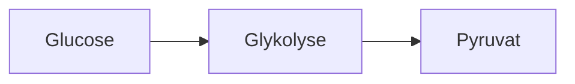

# Mermaid – Umsetzungsplan für Flash-n-Flip

## Status und Zielbild

Mermaid wird als lokal ausgeführter, sicher begrenzter Diagramm-Renderer für
Flash-n-Flip eingeführt. Lernende und Autoren können Diagramme als Textquelle
speichern und auf Web, iPhone und iPad ohne externen Renderdienst anzeigen.

Der Mehrwert entsteht nicht allein durch „Diagramme als Code“, sondern durch
die Verbindung mit Karten, Clozes, `(i)`-Zusatzinhalten, stabilen Lernzielen und
Offlinebetrieb. Die erste Version rendert Diagramme zuverlässig und zugänglich.
Eine spätere Version darf einzelne Knoten oder Kanten als Lernziel verwenden.

## Lizenz und kommerzielle Nutzung

- Mermaid wird unter der MIT-Lizenz veröffentlicht.
- Die MIT-Lizenz erlaubt Nutzung, Änderung und Verteilung, einschließlich
  kommerzieller Nutzung.
- Copyright- und Lizenztext müssen mit ausgelieferten Kopien bzw. wesentlichen
  Teilen der Software erhalten bleiben.
- Die verwendete Version wird exakt gepinnt; vor Release werden Paketinhalt,
  Lockfile und transitive Lizenzen erneut geprüft.
- `docs/THIRD_PARTY_NOTICES.md` wird um Mermaid, Copyright-Angabe,
  Lizenzbezeichnung und Upstream-URL ergänzt.
- Die Entscheidung ist eine technische Lizenzbewertung, keine anwaltliche
  Rechtsberatung. Vor einem öffentlichen Store- oder Produktrelease bleibt eine
  qualifizierte Lizenzprüfung sinnvoll.

Offizielle Quellen:

- <https://github.com/mermaid-js/mermaid>
- <https://github.com/mermaid-js/mermaid/blob/develop/LICENSE>
- <https://mermaid.js.org/>

## Produktumfang der ersten Version

Phase 1 unterstützt bewusst nur stabile, lernrelevante Diagrammarten:

1. Flowchart
2. Sequence Diagram
3. State Diagram
4. Class Diagram
5. Entity Relationship Diagram
6. Mindmap
7. Timeline

Spätere Kandidaten nach separater Prüfung:

- Git Graph
- User Journey
- Gantt
- Sankey
- XY Chart
- Block- und Architekturdiagramme

Experimentelle oder sicherheitskritische Diagrammarten werden nicht automatisch
durch ein Mermaid-Update freigeschaltet. Jede neue Art benötigt eine explizite
Allowlist-Erweiterung, Sicherheitsfixtures und visuelle Abnahme.

## Nicht-Ziele

- kein PlantUML-Kompatibilitätslayer
- kein externer Mermaid- oder Kroki-Renderdienst
- keine automatische Ausführung beliebiger Markdown-Codeblöcke
- keine Links, Klick-Callbacks oder JavaScript-Funktionen in Diagrammen
- kein beliebiges HTML, CSS, Icon-Pack oder externes Bild
- keine Speicherung von gerendertem Roh-SVG als autoritativer Karteninhalt
- keine interaktive Bewertung von Diagrammknoten in Phase 1

## Benutzererlebnis

### Editor

Der Karteneditor erhält einen eigenen Block „Diagramm (Mermaid)“ mit:

- Auswahl der erlaubten Diagrammart
- Quelltextfeld mit Monospace-Darstellung
- lokal gerenderter Vorschau
- verständlicher Fehleranzeige mit Zeile und Spalte, soweit Mermaid diese liefert
- Pflichtfeld `Beschreibung für Screenreader`
- optionalem kurzen sichtbaren Titel
- Schaltfläche zum Einfügen eines sicheren Minimalbeispiels
- Syntaxhilfe im `(i)`-Bereich statt einer überladenen Editoroberfläche

Die Vorschau aktualisiert verzögert und nur nach einer kurzen Eingabepause. Ein
fehlerhaftes Diagramm überschreibt niemals die zuletzt gespeicherte gültige
Karte.

### Study

- Diagramme skalieren in den verfügbaren Kartenbereich.
- Kleine Diagramme werden nicht unnötig vergrößert.
- Große Diagramme erhalten kontrolliertes Zoomen und Verschieben innerhalb des
  Diagrammbereichs, ohne Seiten-Pinch oder Kartennavigation zu übernehmen.
- Ein expliziter Reset stellt Zoom und Position wieder her.
- Die Frage-/Antwort-Steuerung bleibt außerhalb des Diagrammbereichs erreichbar.
- Diagramme in `(i)` verwenden denselben Renderer und dieselben Schutzgrenzen.
- Bei einem Renderfehler erscheint eine sichere Textdarstellung mit Titel,
  Beschreibung und Quelltext; die Karte bleibt bedienbar.

## Inhaltsmodell

Mermaid wird als eigener strukturierter Block im Domain-Paket modelliert:

```ts
type MermaidDiagramBlock = {
  type: "mermaidDiagram";
  version: 1;
  diagramType:
    | "flowchart"
    | "sequence"
    | "state"
    | "class"
    | "er"
    | "mindmap"
    | "timeline";
  source: string;
  label: string;
  description: string;
};
```

Verbindliche Grenzen:

- `source`: 1 bis 20.000 Zeichen
- `label`: 1 bis 300 Zeichen
- `description`: 1 bis 5.000 Zeichen
- höchstens 150 Knoten und 300 Kanten
- höchstens 50 Sequenzteilnehmer bzw. vergleichbare Diagrammobjekte
- begrenzte Verschachtelung und begrenzte Label-Länge
- UTF-8-Text, aber keine Steuerzeichen außer Zeilenumbruch und Tabulator

`diagramType` wird nicht nur aus der Quelle geraten. Die deklarierte Art muss
mit dem geparsten Diagramm übereinstimmen. Dadurch können Validierung, Editor
und Renderer dieselbe freigegebene Teilmenge erzwingen.

## Autorensyntax

Erlaubtes Beispiel:



Nicht erlaubt:

```text
click node callback
click node "https://example.com"
%%{init: ...}%%
<script>...</script>

```

Konfiguration, Theme und Sicherheitsparameter kommen ausschließlich aus der App
und niemals aus Kartendaten. Frontmatter, Init-Direktiven, Links, Callbacks,
HTML-Labels, Icons, Bildquellen, eigene CSS-Klassen und Styles werden in Phase 1
abgewiesen.

## Rendering-Architektur

```text
CardContent
  -> kanonisches Domain-Schema
  -> statische Sicherheitsvalidierung
  -> apps/web Mermaid-Adapter
  -> lokaler Mermaid-Parser/Renderer
  -> SVG-Allowlist und DOM-Aufbau
  -> zugänglicher Diagramm-Container
```

- Das Domain-Paket enthält nur Typ, Schema, Größenlimits und reine Validierung.
- Das Domain-Paket importiert Mermaid nicht.
- `apps/web` besitzt den Renderer und lädt Mermaid dynamisch nur, wenn ein
  Mermaid-Block sichtbar wird.
- Capacitor verwendet denselben Web-Renderer und dieselbe geprüfte Paketversion.
- Es gibt keine Server- oder VPS-Abhängigkeit.
- Der Renderer startet nicht global über `startOnLoad`; nur explizite
  FNF-Komponenten dürfen rendern.
- Die Diagrammquelle bleibt autoritativ. Abgeleitete Darstellung wird höchstens
  nach Quellhash im Gerätespeicher gecacht und kann jederzeit neu erzeugt werden.
- Cacheeinträge dürfen keinen privaten Inhalt an Logs, Telemetrie oder externe
  Empfänger übertragen.

## Sicherheitsmodell

Mermaid verarbeitet nutzergenerierte Sprache und erzeugt SVG. Deshalb genügt
`securityLevel: "strict"` allein nicht als FNF-Sicherheitsgrenze.

Verbindliche Konfiguration:

- `securityLevel: "strict"`
- `startOnLoad: false`
- HTML-Labels deaktiviert
- App-eigenes festes Theme
- App-eigene feste Fontfamilie
- sichere Konfigurationsschlüssel gegen Diagrammüberschreibung sperren
- Text-, Knoten- und Kantenlimits setzen
- Fehlerdarstellung von Mermaid unterdrücken und durch FNF-Fehler-UI ersetzen

Zusätzliche FNF-Prüfungen:

1. verbotene Direktiven und Frontmatter vor dem Rendern abweisen
2. Links, URLs, `click`, Callbacks, Bilder und HTML abweisen
3. Mermaid-Quelltext niemals als HTML einsetzen
4. erzeugtes SVG mit enger Element-/Attribut-Allowlist prüfen
5. `foreignObject`, `script`, Eventattribute, externe Referenzen, `style`-Blöcke,
   `href`, `xlink:href`, `url(...)` und unbekannte Namespaces entfernen bzw. den
   gesamten Render als ungültig verwerfen
6. keine direkte Verwendung von `dangerouslySetInnerHTML` mit ungeprüftem
   Mermaid-Ergebnis
7. Rendering zeitlich begrenzen und bei Überschreitung abbrechen
8. wiederholte Fehler dürfen keine Endlosschleife oder Akku-Dauerlast erzeugen

Die aktuelle Content-Policy verbietet SVG-Markup in Karten. Vor Umsetzung wird
per ADR klargestellt: Kartendaten dürfen weiterhin kein SVG enthalten;
app-eigener, flüchtig erzeugter und allowlist-geprüfter Vektor-DOM darf nur im
vertrauenswürdigen Renderer entstehen. Wird diese Grenze nicht belastbar
umgesetzt, ist Mermaid ein Release-Blocker.

## Datenschutz und Local-first

- Diagrammquellen bleiben in IndexedDB bzw. SQLite wie übriger Karteninhalt.
- Keine Quelle wird zum Rendern an Mermaid Live, einen CDN-Dienst, Kroki,
  PlantUML oder den VPS übertragen.
- Mermaid, Layoutcode, Fonts und alle benötigten Assets werden mit der App
  ausgeliefert.
- Es entstehen keine neuen externen Empfänger, Cookies, Tracker oder
  Telemetriepfade.
- Synchronisation repliziert nur den strukturierten Block über den bestehenden
  direkten Sync-Pfad.
- Export und Restore erhalten Quelle, Typ, Version, Label und Beschreibung.

## Barrierefreiheit

- Jeder Block besitzt einen sichtbaren oder programmatisch zugeordneten Titel.
- `description` wird als Textalternative bereitgestellt und darf nicht aus dem
  Diagrammquelltext automatisch geraten werden.
- Der SVG-Baum wird für Screenreader nicht doppelt vorgelesen, wenn die
  Textalternative autoritativ ist.
- Zoom, Pan und Reset sind per Tastatur und Touch bedienbar.
- Fokus darf beim Neu-Rendern nicht verloren gehen.
- Farben sind nicht das einzige Unterscheidungsmerkmal; Linienarten, Labels und
  Formen tragen Bedeutung mit.
- Hell-/Dunkelmodus und erhöhter Kontrast erhalten lesbare Linien und Texte.
- Eine linearisierte Textansicht zeigt Knoten und Beziehungen auf Wunsch als
  Liste, insbesondere für Flow-, State- und Sequence-Diagramme.

## Lerninteraktion – spätere Phase

Phase 2 kann explizite, stabile Lernziele ergänzen:

```ts
type MermaidTarget = {
  targetId: string;
  kind: "node" | "edge";
  prompt: string;
};
```

Mögliche Aufgaben:

- verdeckten Knotentext aufdecken
- fehlenden Übergang bestimmen
- richtigen nächsten Prozessschritt auswählen
- Fehlerkante markieren
- Zustandsfolge ordnen

Diese Ziele werden nicht aus instabilen, automatisch generierten SVG-IDs
abgeleitet. Autoren müssen stabile Mermaid-Knotenkennungen verwenden; Domain-
Validierung stellt sicher, dass jedes Ziel genau einmal existiert. Lernantworten
werden weiterhin über normale Review-Ereignisse bewertet und verändern keine
Diagrammquelle.

## Import, Export und Kompatibilität

- Markdown kann einen explizit freigegebenen `mermaid`-Codeblock in einen
  strukturierten Block umwandeln.
- Unbekannte oder verbotene Mermaid-Syntax bleibt sicherer Codeblock und wird
  niemals implizit ausgeführt.
- Anki-HTML, `<script>`-Elemente und Add-on-Code werden nicht als Mermaid
  interpretiert.
- FNF-Export speichert die Quellsyntax und Blockversion.
- Ältere Clients zeigen Label, Beschreibung und Quellcode als Fallback statt
  den Block zu verlieren.
- Sync-Protocol/Wire-Fingerprint wird angepasst, sobald der neue Block Teil der
  replizierten Kartenschemata wird.

## Performance und Betrieb

- Mermaid wird per Code-Splitting geladen.
- Unsichtbare Karten rendern nicht vorab.
- Rendering wird nach Quellhash dedupliziert.
- Ein Diagramm rendert höchstens einmal pro stabiler Quelländerung.
- Editorvorschau verwendet Debounce und Abbruch veralteter Renderaufträge.
- Animationen sind in Phase 1 deaktiviert.
- `visibilitychange`, Kartenwechsel und Komponenten-Unmount stoppen offene
  Arbeit und lösen Observer.
- Speicher- und CPU-Verhalten werden auf einem realen iPhone/iPad profiliert.

## Umsetzungsschritte

1. ADR für sicheren app-generierten Vektor-DOM und Renderer-Grenzen erstellen.
2. Mermaid-Version und transitive Lizenzen prüfen und exakt pinnen.
3. Third-Party Notices erweitern.
4. Domain-Schema, Fallback und Migration ergänzen.
5. reine Source-Validierung mit Allowlist und Limits implementieren.
6. lazy geladenen Web-/Capacitor-Renderer implementieren.
7. SVG-Ausgabe allowlisten und unsichere Ergebnisse vollständig verwerfen.
8. Editorblock, Vorschau, Fehlerzustände und Syntaxhilfe ergänzen.
9. Study-, `(i)`-, Export-, Import- und Sync-Pfade ergänzen.
10. Accessibility-, Sicherheits-, Performance- und Real-Device-Abnahme
    durchführen.
11. Erst nach Phase-1-Abnahme stabile Lernziele für Knoten/Kanten planen.

## Tests

### Domain

- gültige Quellen jeder erlaubten Diagrammart
- falsche deklarierte Diagrammart
- Zeichen-, Knoten-, Kanten- und Verschachtelungsgrenzen
- verbotene Direktiven, Links, HTML, CSS und Steuerzeichen
- Schema-Roundtrip, Export, Import und alter Client-Fallback

### Security

- `<script>`, `foreignObject`, Eventattribute und URL-Schemata
- Mermaid `click` mit URL und Callback
- Init-/Config-Direktiven und Theme-Überschreibung
- CSS- und Attribut-Injektion
- übergroße, zyklische oder pathologische Diagramme
- erzeugtes SVG mit unerwarteten Elementen/Attributen
- keine Netzwerkzugriffe während Rendering

### UI und Accessibility

- Editorfehler ohne Datenverlust
- Front, Back und `(i)`
- iPhone-Größe, iPad, 200 % Browserzoom und große Schrift
- Hell-/Dunkelmodus und hoher Kontrast
- Tastatur, VoiceOver, Fokusreihenfolge und Textalternative
- Zoom/Pan ohne Konflikt mit Study-Gesten

### Performance

- erstes Lazy Loading
- wiederholtes Öffnen derselben Karte
- zehn Diagramme in einer langen Referenzkarte
- Kartenwechsel während laufendem Rendern
- Hintergrund/Vordergrund und Prozessneustart
- reale iOS-WebView-Profilierung ohne persistente Timer oder Akku-Dauerlast

## Abnahmekriterien

- alle Diagramme rendern vollständig lokal und offline
- keine Diagrammquelle verlässt das Gerät zum Rendern
- kein verbotener Link, Callback, HTML-, CSS- oder Skriptpfad ist ausführbar
- ungültige Inhalte führen zu sicherem Fallback statt Kartenverlust
- Web und iOS-WebView zeigen denselben Inhalt
- Diagramme überlappen keine Study-Steuerung und bleiben zugänglich
- Export, Restore, Sync und ältere Clients verlieren keine Quelle
- Lizenzhinweise sind vollständig mit der ausgelieferten Version verbunden

## Reviewstatus vor Implementierung

- **erfüllt:** MIT-Lizenz erlaubt die geplante lokale und kommerzielle Nutzung.
- **erfüllt:** Der bestehende strukturierte `CardContent`-Ansatz kann einen
  typisierten Mermaid-Block aufnehmen.
- **offen:** ADR, SVG-Allowlist, Parsergrenzen, Editor und Fallback müssen
  implementiert und real auf iOS geprüft werden.
- **Release-Blocker:** externer Renderdienst, ungeprüftes SVG, beliebige
  Konfiguration, Links/Callbacks oder implizite Ausführung von Codeblöcken.
- **anwaltlich prüfen:** finale Lizenz- und Notice-Prüfung der tatsächlich
  ausgelieferten Mermaid-Version und ihrer transitiven Abhängigkeiten.
